# ShortJob — MVP, SRS and Microservices Diagrams

> Repository basis: `Ajay120503/ShortJob` (reviewed 27 August 2026).  
> Architecture note: the repository currently contains one Express backend with modular routes/controllers. The microservices diagrams below describe a proposed target architecture.

## 1. Product System Context

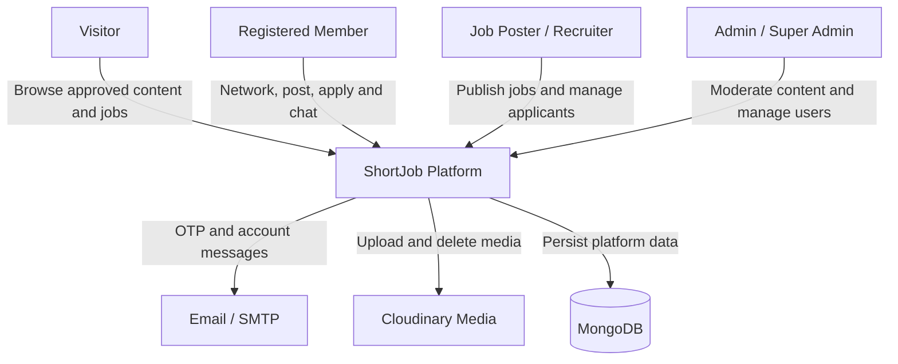

## 2. MVP Scope

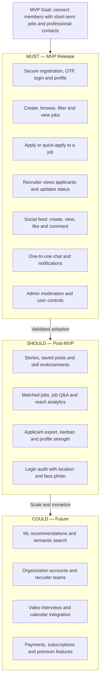

## 3. MVP Success Flow

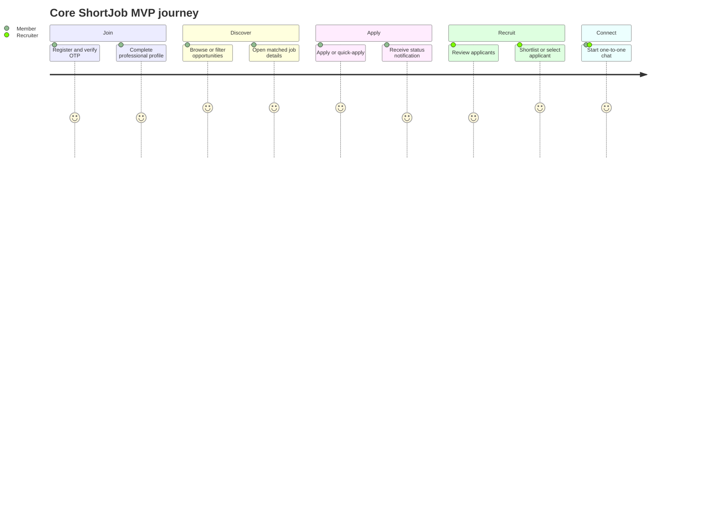

## 4. SRS — Actors and Use Cases

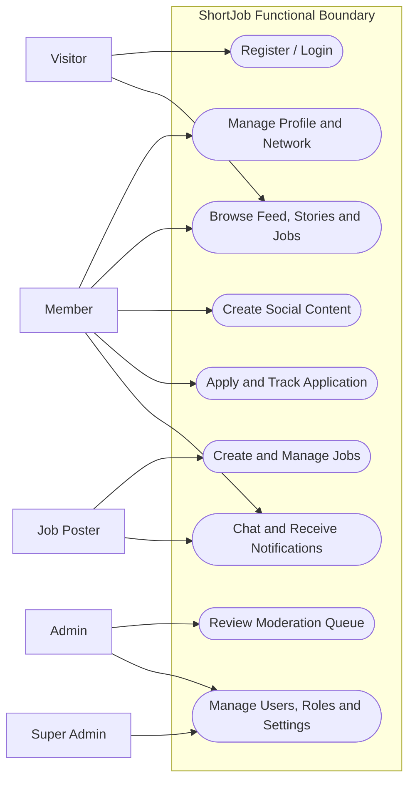

## 5. SRS — Functional Requirement Map

```mermaid
flowchart TB
    SRS["ShortJob Functional Requirements"]

    SRS --> AUTH["FR-01 Authentication"]
    AUTH --> AUTH1["OTP registration and email verification"]
    AUTH --> AUTH2["JWT cookie login, refresh and logout"]
    AUTH --> AUTH3["Password recovery and account deletion"]

    SRS --> USER["FR-02 Profile and Network"]
    USER --> USER1["Profile, skills, qualifications and timeline"]
    USER --> USER2["Search, follow and skill endorsement"]
    USER --> USER3["Presence privacy and opportunity status"]

    SRS --> SOCIAL["FR-03 Social Content"]
    SOCIAL --> SOCIAL1["Posts, images, types, likes and saves"]
    SOCIAL --> SOCIAL2["Nested comments and replies"]
    SOCIAL --> SOCIAL3["Stories with views and expiry"]

    SRS --> JOB["FR-04 Jobs and Applications"]
    JOB --> JOB1["Publish, edit, filter and remove jobs"]
    JOB --> JOB2["Apply, quick-apply and prevent duplicates"]
    JOB --> JOB3["Applicant status, Q&A, matching and statistics"]

    SRS --> COMMS["FR-05 Communication"]
    COMMS --> COMMS1["Conversation and text/media/file messages"]
    COMMS --> COMMS2["Typing, reactions, read receipts and presence"]
    COMMS --> COMMS3["Persistent and real-time notifications"]

    SRS --> ADMIN["FR-06 Administration"]
    ADMIN --> ADMIN1["Moderation queue and rule-based checks"]
    ADMIN --> ADMIN2["Approve/reject posts, jobs and stories"]
    ADMIN --> ADMIN3["Roles, blocks, badges, settings and audit records"]
```

## 6. SRS — Role and Permission Model

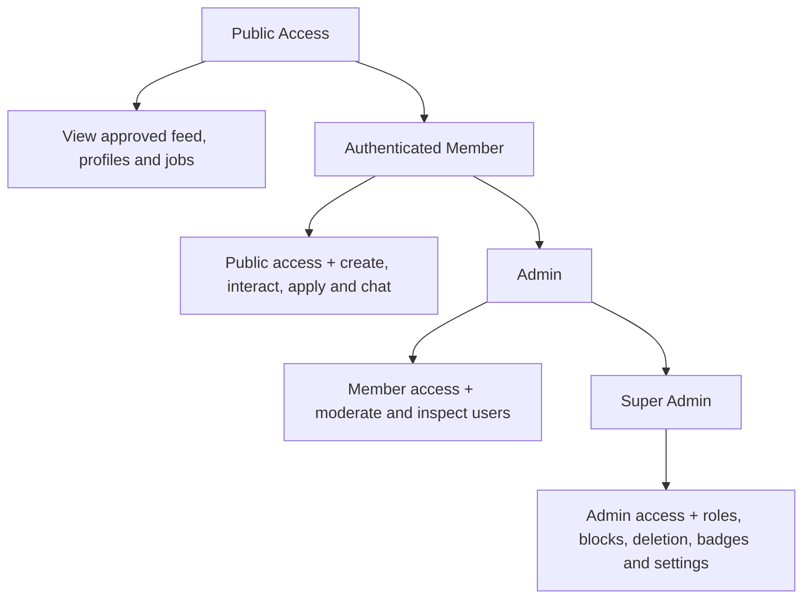

## 7. SRS — Non-Functional Requirements

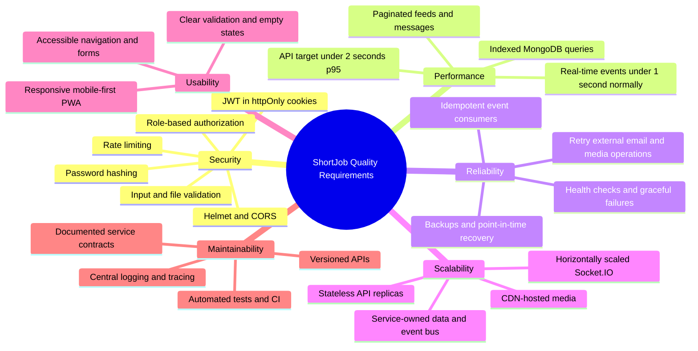

## 8. SRS — Core Domain Data Model

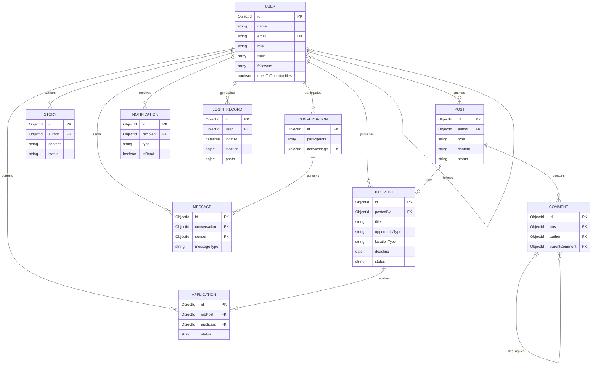

## 9. Current Repository Architecture

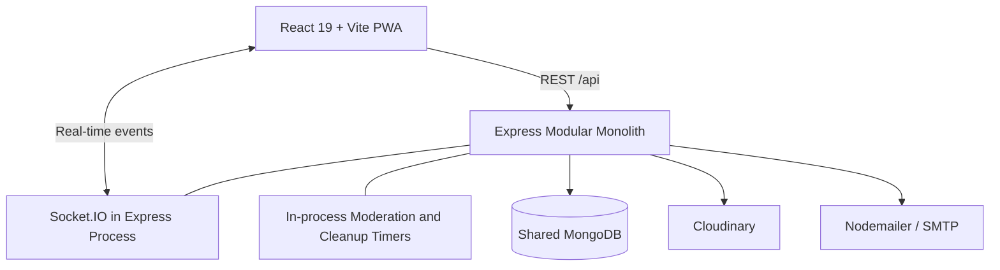

## 10. Proposed Microservices Architecture

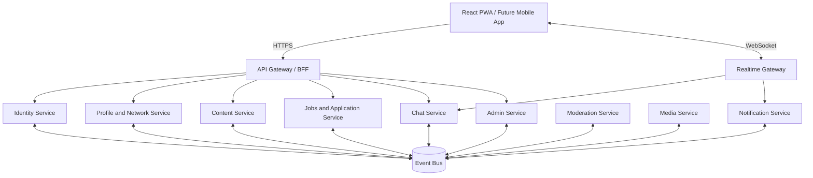

## 11. Microservice Responsibility and Data Ownership

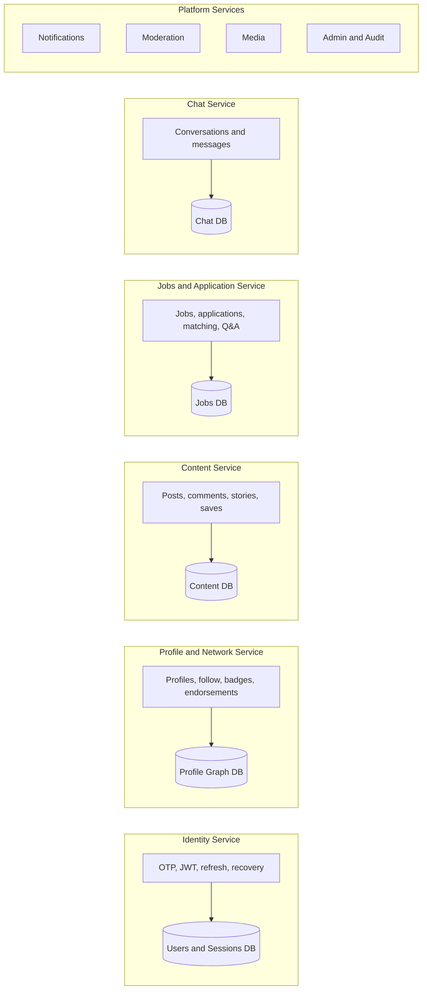

## 12. Job Application Event Flow

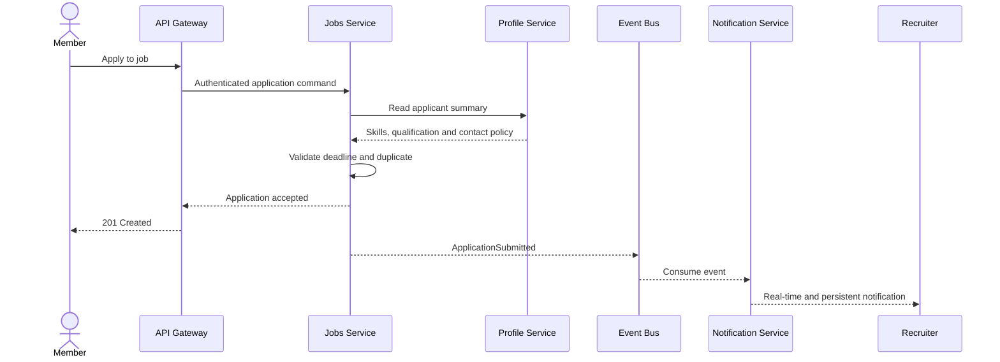

## 13. Moderated Content Publishing Flow

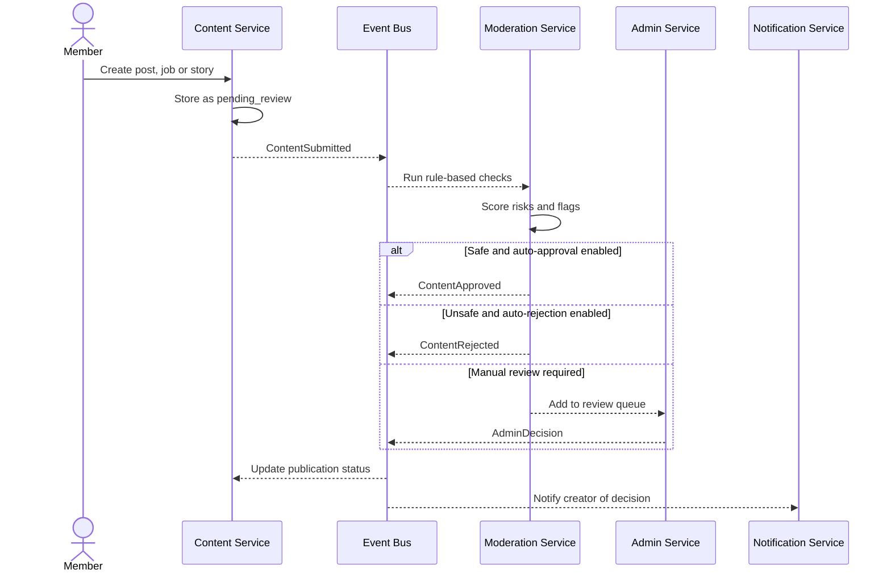

## 14. Real-Time Chat Flow

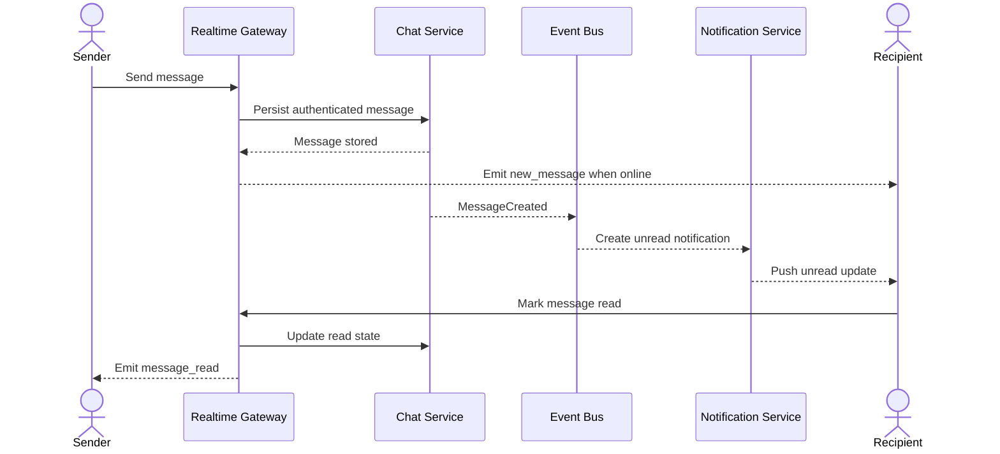

## 15. Target Deployment Flow

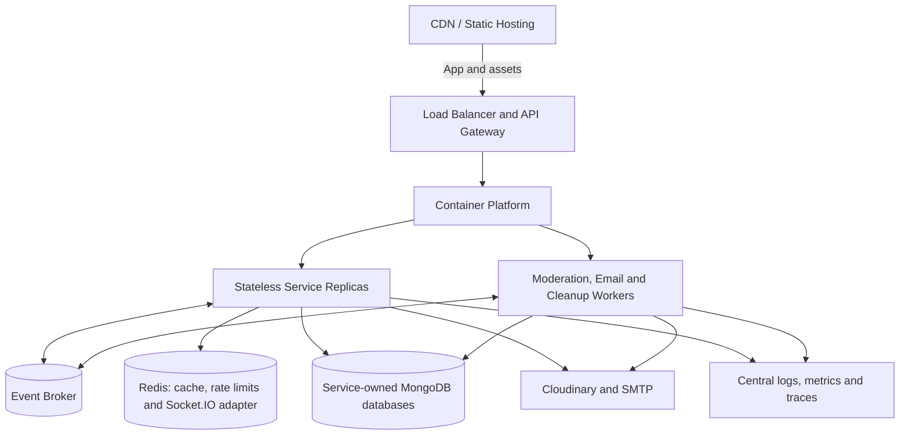

## 16. Safe Migration from Monolith to Microservices

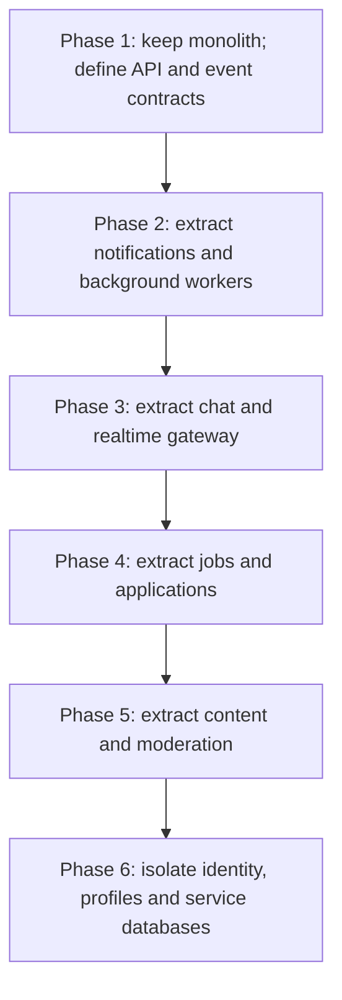
